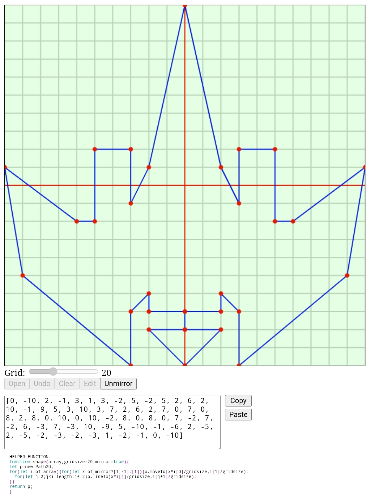

## 🚀 DEMO

[](https://bacionejs.github.io/vectorbay/)

# 🚀 VectorBay

*A hangar for building vector spaceships.*

**VectorBay** is a minimalist vector editor made for game developers. It’s especially designed to help you draw symmetrical spaceships using clean, simple point arrays — perfect for procedural games, 2D shooters, or anything needing scalable geometry.

While most vector tools are either too bloated or too basic, VectorBay hits the sweet spot: fast, focused, and mobile-friendly.

---

## ✨ Features

### 🛠 Drawing Tools
- **Grid Size Slider**  
  Choose your drawing resolution with a snap-to-grid layout.
  
- **Click-to-Draw**  
  Just tap or click on the canvas to place points and build shapes.

- **Undo / Clear**  
  Step back or wipe the canvas clean anytime.

- **Edit Mode**  
  Reposition existing points by dragging them (touch-supported).

- **Mirror Mode**  
  Draw just one half — VectorBay reflects it live. Perfect for symmetric ships.

### 📎 Input & Output
- **Copy & Paste**  
  Use the system clipboard to save or load your vector arrays.

- **Paste Vector Code**  
  Drop in an array like `[0,-3,2,0,0,0]` and see it render immediately.

- **Exported Format**  
  Outputs ready-to-use point arrays compatible with canvas rendering.

### 🖼 Image Tracing
- **Open Background Image**  
  Load a bitmap as a reference image.

- **Pinch Zoom & Pan**  
  Use two fingers (or mouse) to scale and position the image.

### 📱 Touch Support
- Fully usable on phones and tablets  
  (drag, tap, pinch, zoom — it all works!)

---

## 🧰 The `shape()` Helper Function

Use this to render VectorBay shapes in your game:

```js
function shape(array, gridsize = 1, mirror = true) {
  let p = new Path2D;
  for (let i of array) {
    for (let x of mirror ? [1, -1] : [1]) {
      p.moveTo(x * i[0] / gridsize, i[1] / gridsize);
      for (let j = 2; j < i.length; j += 2)
        p.lineTo(x * i[j] / gridsize, i[j + 1] / gridsize);
    }
  }
  return p;
}
```

- `array`: A flat point array like `[x, y, x, y, ...]` or a list of such arrays.
- `gridsize`: The grid size used during editing — determines scaling.
- `mirror`: Whether to reflect the shape across the vertical axis.

### 🔍 Usage Examples

```js
// Simple mirrored ship
ctx.fill(shape([0, -3, 2, 0, 0, 0], 20, true));

// Multi-shape ship with engine flame
ctx.fill(shape([
  [0, -3, 2, 0, 0, 0],     // body
  [0, 1, 1, 1, 0, 2]       // flame
], 20, true));
```

> ✅ You can scale, rotate, and translate the result using `ctx.save()`, `ctx.translate()`, `ctx.rotate()`, `ctx.scale()` — then `ctx.fill()` your shape.

---

## 🧠 Why Use Half-Ships?

Designing one half and letting the tool mirror it:

- 🔧 Makes editing faster and easier
- 🧼 Keeps your point arrays cleaner
- 📦 Saves space in code — great for jam-sized games

For **asymmetrical ships**, simply disable Mirror mode or pass `mirror = false` to `shape()`.

---

## ⚠️ Limitations

- **No Curves**  
  All shapes are straight-line polygons.

- **One Shape at a Time**  
  You can only edit one shape in the app.  
  To use multiple shapes, create them individually and wrap them as sub-arrays:

```js
let ship = shape([ shape1, shape2, shape3 ], 20, true);
```

- **Locked Controls**  
  Some buttons (like Undo, Clear, Open) are disabled during Edit or Mirror mode for safety.

---

## 🎯 Tracing Workflow Tips

If you're not confident in freehand drawing, VectorBay works great for tracing ships from the internet:

1. **Find a reference image** of a spaceship with the shape you want.
2. Use the **Open Image** button to load it into the canvas.
3. **Pinch and zoom** the image to align it with the grid.
4. Pick the **smallest grid size** that still captures the level of detail you want.
5. **Draw only the major features** — don't trace every pixel. Simplify the form.
6. Use **Mirror Mode** to cut your work in half and maintain symmetry.

For most ships, a **grid size of 20** strikes a good balance between precision and simplicity.

> You're not trying to recreate the ship exactly — you're distilling its shape into a clean, readable abstraction suitable for games.

---

Enjoy designing ships!  
Feel free to open an issue or PR if you want to contribute or share examples.
